# 📋 PROJETO ARIANO — Documento de Visão e Planejamento do MVP

> **Versão:** 1.0.0  
> **Data:** 16/03/2026  
> **Status:** Sprint Planning 0 — Documento Inicial  
> **Metodologia:** SCRUM (adaptado para contexto acadêmico)

---

## Informações do Projeto

| Campo | Detalhe |
|-------|---------|
| **Instituição** | UNINASSAU Graças — Recife/PE |
| **Disciplina** | Tópicos Integradores — 7º Período |
| **Semestre** | 2026.1 |
| **Projeto** | ARIANO — **A**rquitetura de Inteligência **A**rtificial **N**aturalmente **O**rdenada |
| **Produto** | MVP do Módulo de Matchmaking para a plataforma **CORETO** |

### Equipe

| Nome | Matrícula | Papel |
|------|-----------|-------|
| Guilherme Andrade de Aguiar | 01606498 | Product Owner / Tech Lead / Product Manager |
| Pedro Miranda | 01607408 | DevOps / Developer Back-End |
| Ricardo Cezar O. A. de Almeida | 01606498 | Data Architect |
| Marcio Maycom | 01607574 | UX UI Designer / Developer Front-End |
| Thiago José Falcão de Freitas | 01597267 | Scrum Master / QA |

---

## 1. Introdução e Contextualização

### 1.1 O que é o CORETO?

O **CORETO** é uma **plataforma digital da Prefeitura do Recife** que funciona como um ecossistema de inovação conectando os quatro pilares da **quádrupla hélice**: **Academia**, **Governo**, **Indústria** e **Sociedade Civil**. A plataforma visa promover a colaboração entre esses eixos para resolver desafios urbanos e fomentar a inovação no ecossistema de Recife.

O nome "Coreto" é uma metáfora ao espaço público de encontro e troca — assim como o coreto de uma praça reúne pessoas, a plataforma reúne solucionadores de problemas (academia, empresas) com donos de problemas (governo, sociedade).

### 1.2 O que é o ARIANO?

O **ARIANO** (**A**rquitetura de **I**nteligência **A**rtificial **N**aturalmente **O**rdenada) é o **motor de matchmaking inteligente** que opera por trás da plataforma CORETO. Ele é responsável por:

1. **Interpretar** perfis de acadêmicos e requisitos de editais governamentais
2. **Classificar** competências, áreas de atuação e níveis acadêmicos
3. **Configurar** um grafo de conhecimento (Knowledge Graph) com relacionamentos ponderados
4. **Executar matches** instantâneos via consulta direta ao grafo pré-configurado

> **Filosofia-chave:** Os agentes de IA **não fazem o match diretamente**. Eles **preparam e configuram o grafo** — interpretam, classificam, enriquecem e criam relacionamentos com pesos calculados. O match em si é apenas uma **query Cypher** que explora a adjacência livre de índice em **O(1)**, garantindo respostas instantâneas independente do volume de dados.

### 1.3 Escopo do MVP — Academia ↔ Governo

> **⚠️ IMPORTANTE:** O MVP (Minimum Viable Product) foca exclusivamente no **matchmaking entre Academia e Governo**, por serem os eixos mais demonstráveis e assertivos para um projeto acadêmico.

| Pilar do MVP | Entidades | Exemplos Concretos |
|---|---|---|
| 🎓 **Academia** | Alunos, Pesquisadores, Docentes | Estudante de CC com skills em ML e NLP |
| 🏛️ **Governo** | Editais FACEPE, Chamadas Públicas, Programas de Fomento | Edital FACEPE 2026 — IA para Saúde |

**Entregas do MVP:**
- ✅ Cadastro de entidades acadêmicas (alunos, pesquisadores, docentes) e editais governamentais
- ✅ Agentes de IA que **interpretam e configuram o grafo** (enriquecimento, classificação, criação de arestas ponderadas)
- ✅ Match via **Cypher query pura** sobre o grafo pré-configurado — O(1) adjacência livre de índice
- ✅ Interface web com **visualizador de grafo interativo** e dashboard de matches
- ❌ NÃO inclui: eixos Indústria/Sociedade Civil, RAG avançado, deploy em produção

---

## 2. Fundamentação Teórica

### 2.1 Grafos de Conhecimento (Knowledge Graphs)

Um **grafo de conhecimento** é uma estrutura de dados que representa entidades como **nós** e seus relacionamentos como **arestas**. No contexto do ARIANO:

- **Nós** representam: Estudantes, Pesquisadores, Professores, Editais, Skills (competências) e Áreas de atuação
- **Arestas** representam: `HAS_SKILL` (possui competência), `RESEARCHES_AREA` (pesquisa área), `REQUIRES_SKILL` (edital requer), `ELIGIBLE_FOR` (elegível para — **a aresta de match**)

A vantagem de um grafo sobre um banco relacional (SQL) é a **adjacência livre de índice**: navegar de um nó para seus vizinhos é uma operação O(1), enquanto JOINs em SQL crescem exponencialmente com a complexidade das relações.

### 2.2 Agentes de IA como Configuradores de Grafo (Precomputed Relational Intelligence)

O conceito de **Precomputed Relational Intelligence** (Inteligência Relacional Pré-computada) foi inspirado no projeto **GitNexus** — um motor de inteligência de código que constrói knowledge graphs a partir de repositórios GitHub. A filosofia é:

```
FASE 1: Agentes IA processam dados → Configuram o grafo (offline, assíncrono)
FASE 2: Match = Query Cypher O(1) sobre grafo pré-configurado (online, instantâneo)
```

Essa abordagem difere radicalmente do RAG (Retrieval-Augmented Generation) tradicional:

| RAG Tradicional | ARIANO (Precomputed) |
|----------------|---------------------|
| LLM processa dados a cada consulta | Agentes processam dados **uma vez**, configuram o grafo |
| Cada match requer chamada à IA (caro, lento) | Match = query Cypher pura (gratuito, instantâneo) |
| Latência de segundos | Latência de milissegundos |
| Custo escala linearmente com consultas | Custo fixo (só na configuração) |

### 2.3 Quádrupla Hélice da Inovação

O modelo da **Quádrupla Hélice** (Quadruple Helix) é um framework de inovação que expande a Tríplice Hélice (Academia-Governo-Indústria) incluindo a **Sociedade Civil** como quarto pilar. O CORETO implementa este modelo digitalmente, e o ARIANO é o mecanismo que conecta esses pilares através de matchmaking inteligente.

---

## 3. Referência de Design — GitNexus

### 3.1 Por que o GitNexus como referência?

O **GitNexus** (https://gitnexus.vercel.app/) é um motor de inteligência de código zero-server que constrói knowledge graphs interativos a partir de repositórios GitHub. Foi escolhido como referência por:

1. **Mesmo paradigma:** Constrói grafos de conhecimento com nós tipados e arestas ponderadas
2. **Visual premium:** Estética dark theme com neon, animações fluidas, clustering visual
3. **Tecnologia comprovada:** Usa Sigma.js v3 + Graphology + ForceAtlas2 — stack que validamos para o ARIANO
4. **Interatividade:** Hover effects, tooltips, seleção com dimming, zoom/pan, filtros

### 3.2 Análise Visual do GitNexus (Screenshots Documentados)

Abaixo estão as capturas de tela do GitNexus analisando o repositório `guiaaguiar/duda-loves-gui-countdown`, documentando cada aspecto do design que será replicado no ARIANO.

#### 3.2.1 Landing Page e Onboarding

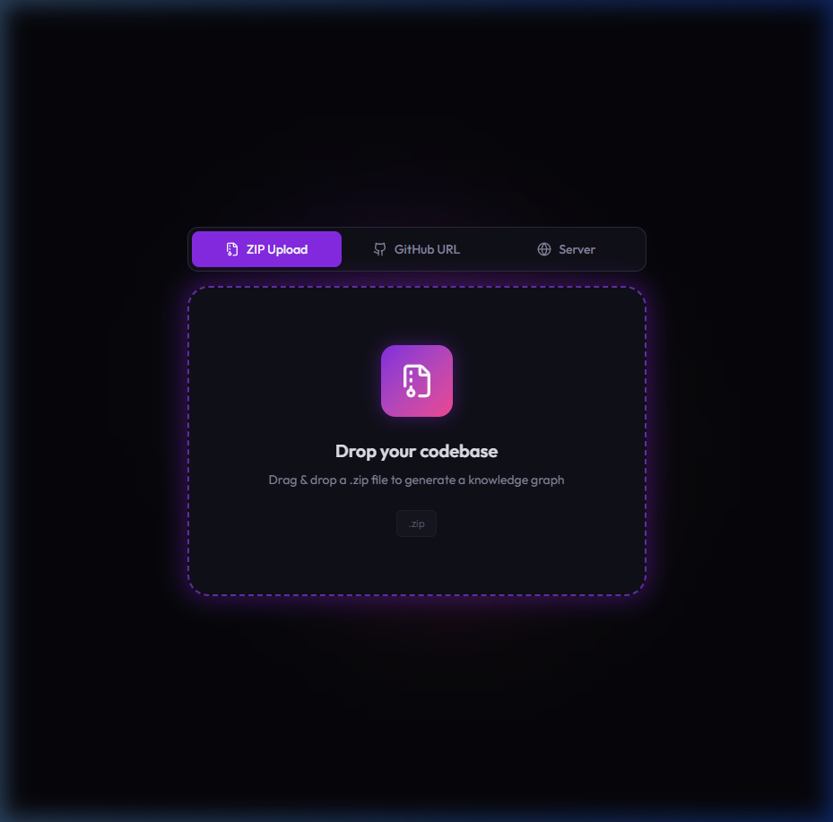

**Elementos de design a replicar:**
- Background escuro (void black) com gradientes sutis
- Cards de opção com bordas sutis e hover states
- Tipografia moderna (Outfit font)
- Esquema de cores accent roxo → ARIANO usará **azul neon** (`#0ea5e9`)

#### 3.2.2 Processo de Análise (Indexação)

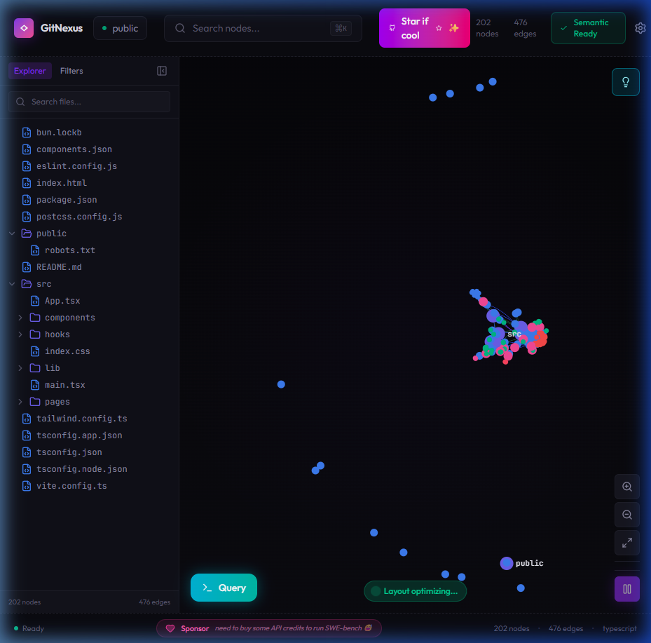

**Para ARIANO:** Feedback visual durante processamento dos agentes IA — mostrar fases: "Analisando perfil...", "Classificando skills...", "Calculando elegibilidade..."

#### 3.2.3 Grafo Interativo — Visão Geral

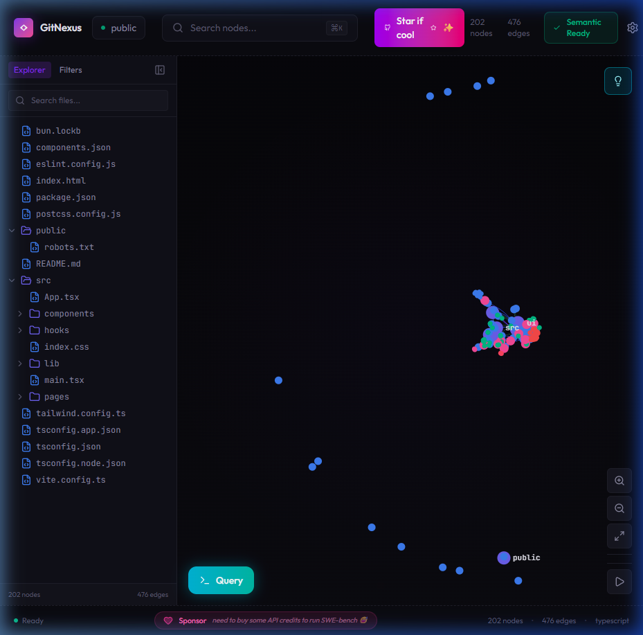

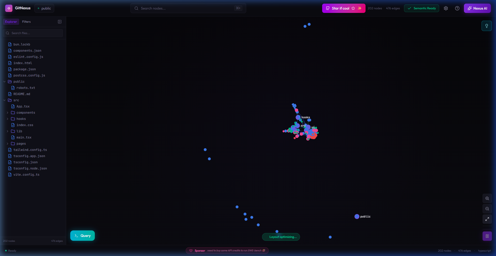

**Características do grafo GitNexus (202 nós, 476 edges):**
- Nós coloridos por tipo (Folder=roxo, File=azul, Function=verde, Class=âmbar, Interface=rosa)
- Clustering natural via ForceAtlas2 — nós relacionados ficam próximos
- Labels visíveis nos nós maiores (clusters: "src", "hooks", "public")
- Edges finos com curvas suaves conectando nós

#### 3.2.4 Hover Effects e Tooltips

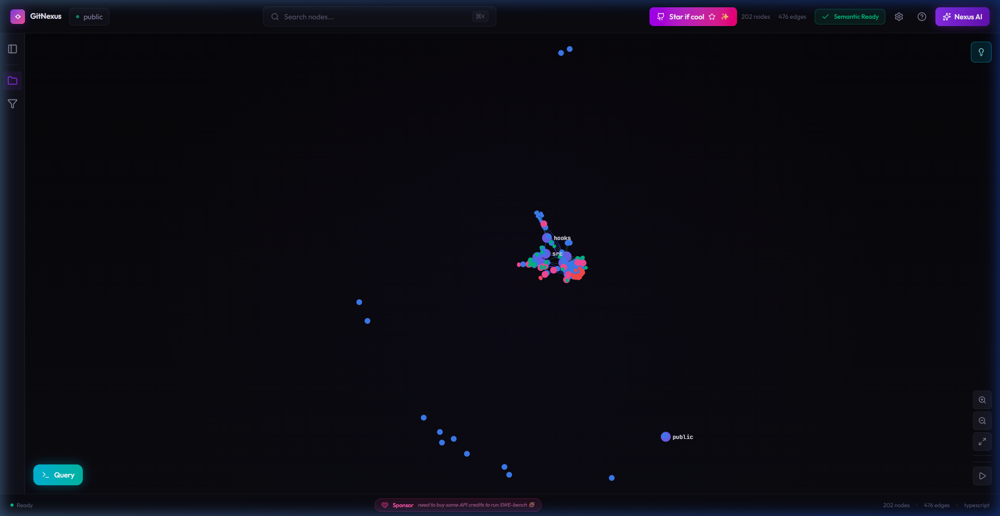

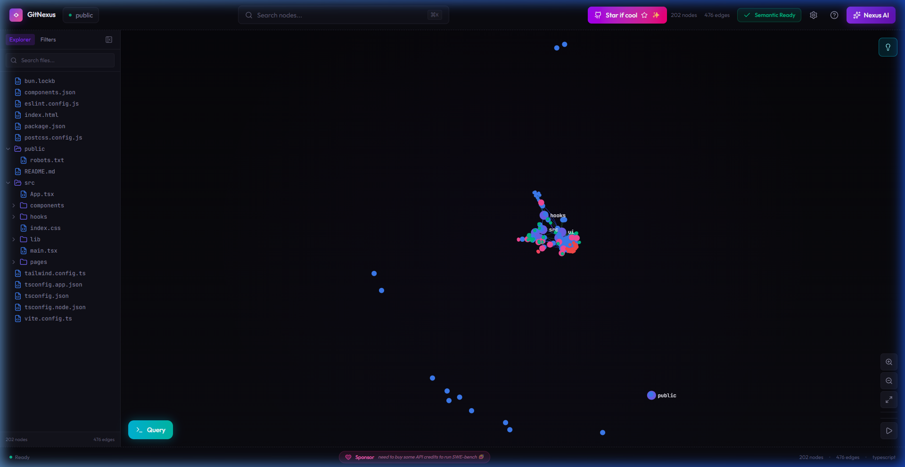

**Técnicas de hover identificadas:**
- **Dark pill tooltip:** Background `#12121c` com borda na cor do tipo do nó
- **Glow ring:** Semicírculo com `globalAlpha: 0.5` ao redor do nó
- **Label:** Nome do nó exibido em texto branco dentro da pill

#### 3.2.5 Seleção e Dimming

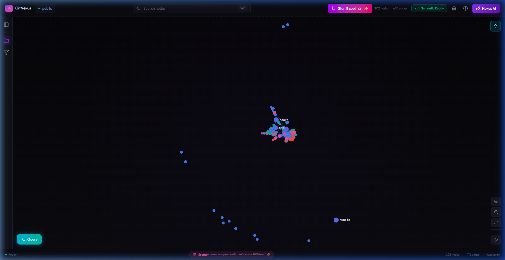

**Comportamento de seleção:**
- Nó selecionado: tamanho 1.8x, cor original intensa
- Vizinhos diretos: tamanho 1.3x, cor original
- Demais nós: dimColor (mistura com fundo escuro, opacidade 0.25), tamanho 0.6x
- Edges não conectados ficam quase invisíveis

#### 3.2.6 Code Inspector e Painéis

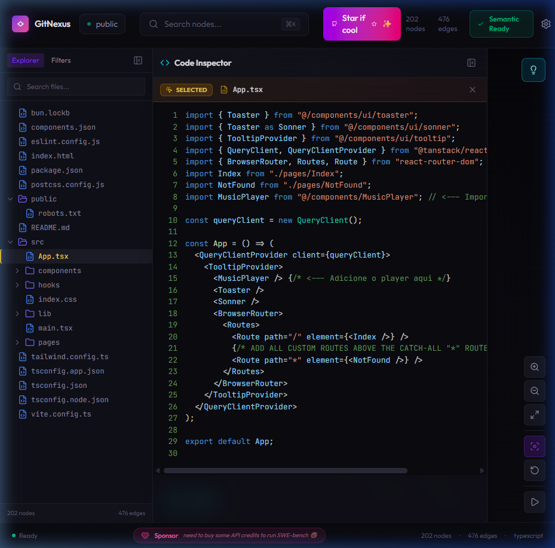

**Para ARIANO:** Painel de detalhes do match mostrando: perfil acadêmico, skills, score de match, justificativa do agente.

#### 3.2.7 Clusters e Zoom

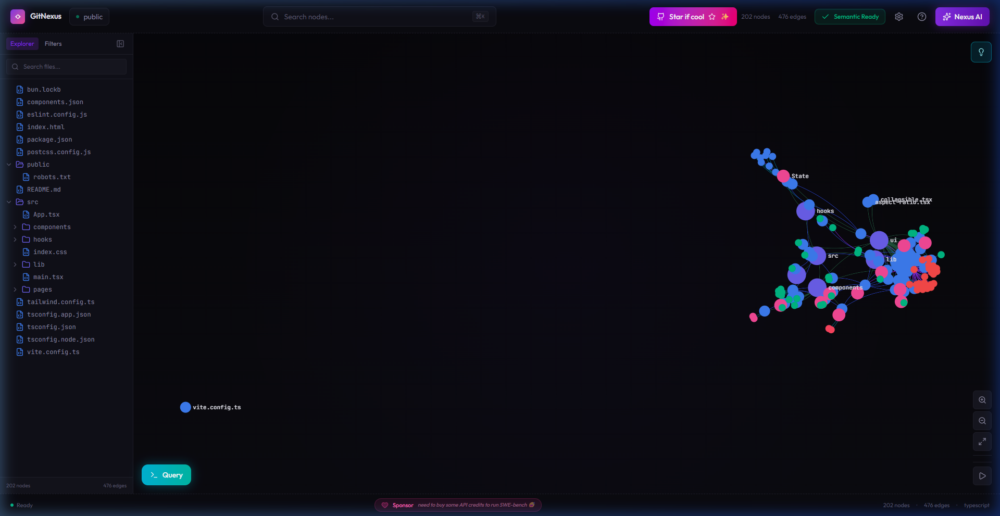

**Para ARIANO:** Clusters temáticos: "IA para Saúde", "Educação", "Ciência de Dados" — pesquisadores e editais da mesma área ficam naturalmente próximos.

#### 3.2.8 Interface de IA (Nexus AI)

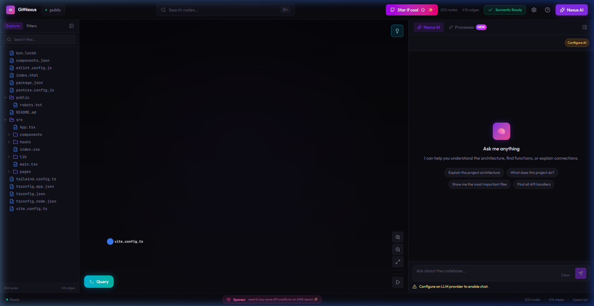

**Para ARIANO:** Chat flutuante para consultar ao agente sobre matches: "Quais pesquisadores são mais elegíveis para o edital FACEPE IA?" → resposta com highlights no grafo.

#### 3.2.9 Filtros e Controles

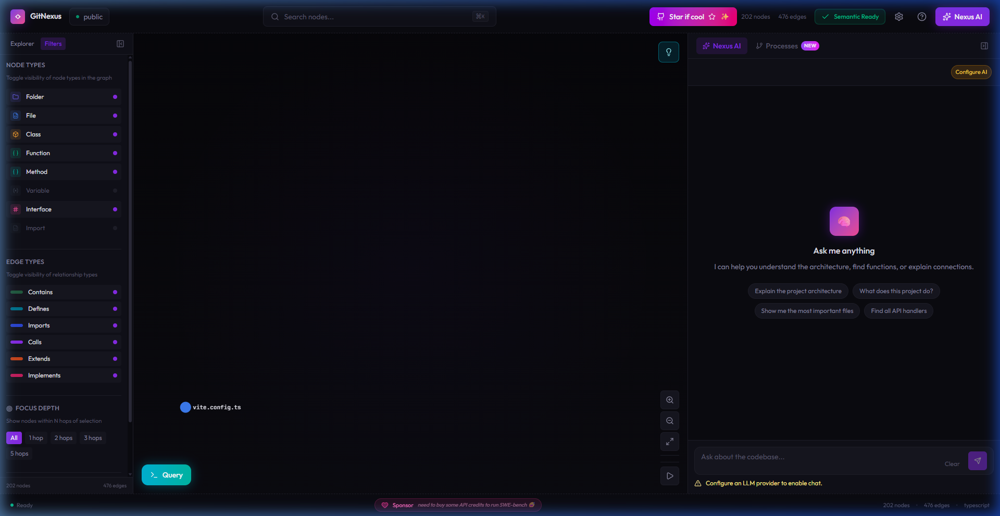

**Para ARIANO:** Filtros por tipo de entidade (Alunos, Professores, Editais) e por tipo de relação (HAS_SKILL, ELIGIBLE_FOR, RESEARCHES_AREA).

#### 3.2.10 Query Interface

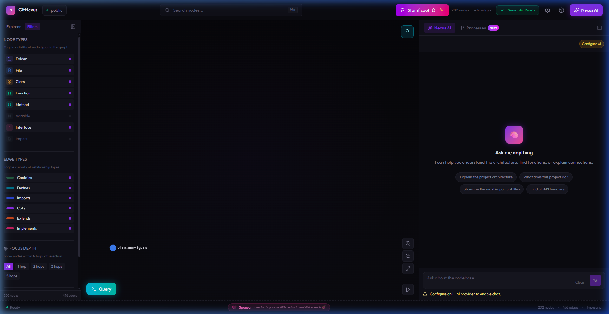

**Para ARIANO:** Interface de busca no grafo — "Machine Learning" → destaca todos os nós com essa skill e seus editais conectados.

### 3.3 Vídeos de Referência

Dois vídeos de gravação completa da exploração do GitNexus foram salvos:

| Arquivo | Descrição |
|---------|-----------|
| `assets/recordings/gitnexus_exploration.webp` | Exploração completa: landing → clone → grafo → painéis → filtros |
| `assets/recordings/gitnexus_hover_effects.webp` | Hover effects, tooltips, seleção com dimming, edge hover |

---

## 4. Arquitetura do Sistema

### 4.1 Visão Geral da Arquitetura

```
┌─────────────────────────────────────────────────────────────┐
│                        FRONTEND                              │
│          Vite 5 + React 18 + TypeScript                      │
│   ┌──────────┐  ┌──────────┐  ┌──────────────────────────┐  │
│   │ Dashboard │  │ Cadastro │  │ Visualizador de Grafo     │  │
│   │ de Matches│  │ Perfis   │  │ (Sigma.js + Graphology)   │  │
│   └──────────┘  └──────────┘  └──────────────────────────┘  │
└──────────────────────┬──────────────────────────────────────┘
                       │ REST API
┌──────────────────────┴──────────────────────────────────────┐
│                        BACKEND                               │
│              Python 3.12 + FastAPI                            │
│                                                              │
│   ┌──────────┐  ┌──────────────────┐  ┌────────────────┐    │
│   │ API REST │  │ Graph Configurator│  │ Match Engine   │    │
│   │ (CRUD)   │  │ (Agentes IA)      │  │ (Cypher Puro)  │    │
│   └──────────┘  └──────────────────┘  └────────────────┘    │
│                         │                      │             │
│   Agentes:              │                      │             │
│   ├─ ProfileAnalyzer    │    Match = Query:     │             │
│   ├─ EditalInterpreter  │    MATCH (a)-[r]->(e) │             │
│   └─ EligibilityCalc    │    WHERE r.score > X  │             │
│                         │    RETURN ...          │             │
└──────────────────────┬──────────────────────────────────────┘
                       │ Bolt Protocol / Cypher
┌──────────────────────┴──────────────────────────────────────┐
│                      DATA LAYER                              │
│   ┌──────────────────────────────────────────────┐          │
│   │           Neo4j (Graph Database)              │          │
│   │  Nós: Student, Researcher, Professor, Edital  │          │
│   │  Arestas: HAS_SKILL, ELIGIBLE_FOR, MATCHES   │          │
│   │  (pré-configuradas pelos agentes com pesos)   │          │
│   └──────────────────────────────────────────────┘          │
└─────────────────────────────────────────────────────────────┘
```

### 4.2 Fluxo de Dados — Duas Fases Distintas

#### FASE 1 — Configuração do Grafo (Agentes IA)

```
Usuário cadastra perfil/edital
  → Backend recebe dados
    → Agente ProfileAnalyzer/EditalInterpreter (LangChain + Gemini)
      → Extrai skills, classifica área, calcula embeddings
        → Cria nós + arestas ponderadas no Neo4j (Cypher)
          → Agente EligibilityCalculator calcula scores
            → Cria/atualiza arestas ELIGIBLE_FOR com score (0.0-1.0)
              → Grafo configurado ✓
```

#### FASE 2 — Match Instantâneo (Cypher Query Pura)

```
Usuário solicita matches
  → Backend executa Cypher:
    MATCH (a)-[r:ELIGIBLE_FOR]->(e:Edital)
    WHERE r.score >= 0.7
    RETURN a, r, e ORDER BY r.score DESC
  → O(1) via adjacência livre de índice
    → Resultado instantâneo com scores e justificativas
```

### 4.3 Modelagem do Grafo

```
    ┌─────────────┐     HAS_SKILL     ┌────────────┐
    │  🎓 Student  │──────────────────>│  📚 Skill   │
    └─────────────┘                    └────────────┘
                                            ▲
    ┌─────────────┐     HAS_SKILL          │
    │ 🎓 Researcher│──────────────────────>│
    └─────────────┘                        │
         │                                 │
         │ RESEARCHES_AREA    REQUIRES_SKILL│
         ▼                                 │
    ┌─────────────┐                   ┌────────────┐
    │  🔬 Area     │<─────────────────│ 🏛️ Edital   │
    └─────────────┘   TARGETS_AREA    └────────────┘
                                           ▲
    ┌─────────────┐     ELIGIBLE_FOR       │
    │ 🎓 Professor │─ ─ ─ ─ ─ ─ ─ ─ ─ ─ >│
    └─────────────┘   (score, justification)
```

**Exemplo de dados:**

```cypher
// Nós Academia
CREATE (:Researcher {name: "Dra. Maria Silva", institution: "UFPE", level: "doutorado"})
CREATE (:Student {name: "João Pedro", institution: "UNINASSAU", semester: 7, course: "CC"})

// Nós Governo
CREATE (:Edital {title: "FACEPE IA 2026", agency: "FACEPE", funding: 200000})

// Nós Referência (criados pelos agentes)
CREATE (:Skill {name: "Machine Learning"})
CREATE (:Area {name: "Saúde Digital"})

// Arestas (criadas/ponderadas pelos agentes)
CREATE (r)-[:HAS_SKILL {confidence: 0.95}]->(s:Skill {name: "ML"})
CREATE (e)-[:REQUIRES_SKILL {priority: "essential"}]->(s)

// A ARESTA DE MATCH (criada pelo EligibilityCalculator)
CREATE (r)-[:ELIGIBLE_FOR {score: 0.92, justification: "92% aderência..."}]->(e)
```

---

## 5. Stack Tecnológica

### 5.1 Stack Final Aprovada

```
┌──────────────────────────────────────────────────────────┐
│                   STACK ARIANO v0                         │
├──────────────────────────────────────────────────────────┤
│                                                           │
│  🎨 FRONTEND                                              │
│  ├─ Vite 5 + React 18 + TypeScript                       │
│  ├─ Tailwind CSS v4 (design system)                       │
│  ├─ Sigma.js v3 + Graphology (grafo interativo WebGL)     │
│  ├─ ForceAtlas2 Worker (layout físico em Web Worker)      │
│  ├─ @sigma/edge-curve (edges curvos)                      │
│  ├─ D3.js (helpers: scales, interpolation)                │
│  ├─ Framer Motion (animações de UI)                       │
│  ├─ React Router v7 (routing)                             │
│  ├─ Lucide React (ícones)                                 │
│  ├─ Outfit + JetBrains Mono (tipografia)                  │
│  └─ React Hook Form + Zod (formulários)                   │
│                                                           │
│  ⚙️ BACKEND                                               │
│  ├─ Python 3.12 + FastAPI                                 │
│  ├─ LangChain + LangGraph (agentes IA)                    │
│  ├─ Google Gemini API (LLM — gemini-2.0-flash)            │
│  ├─ Neomodel (OGM para Neo4j)                             │
│  └─ Uvicorn (servidor ASGI)                               │
│                                                           │
│  🗄️ DADOS                                                 │
│  └─ Neo4j 5.x Community (graph database)                  │
│                                                           │
│  🔧 DEVOPS                                                │
│  ├─ Docker + Docker Compose                               │
│  └─ GitHub Actions (CI/CD)                                │
│                                                           │
└──────────────────────────────────────────────────────────┘
```

### 5.2 Justificativas das Escolhas

| Tecnologia | Justificativa |
|-----------|---------------|
| **Sigma.js + Graphology** | Motor de renderização WebGL comprovado pelo GitNexus. Escala para milhares de nós com animações fluidas. `nodeReducer`/`edgeReducer` permitem highlight dinâmico sem recriar o grafo. |
| **ForceAtlas2 (Web Worker)** | Layout force-directed que roda em thread separada — UI nunca trava. Configurável por tamanho do grafo. |
| **Vite + React** (em vez de Next.js) | ARIANO é uma SPA interativa 100% client-side. Grafo, animações e dashboard são client-heavy. Next.js introduziria overhead de SSR desnecessário. Vite tem HMR < 50ms. |
| **Neo4j** | Adjacência livre de índice = O(1) para navegação de grafos. Cypher é intuitivo. Perfeito para um sistema de relacionamentos. |
| **FastAPI + Python** | Ecossistema de IA incomparável (LangChain, LangGraph, Google AI SDK). Async nativo, Swagger automático. |
| **Google Gemini** | Rápido, barato, generosa free tier. `gemini-2.0-flash` ideal para prototipagem. |
| **Tailwind CSS v4** | Consistente com a apresentação do projeto. Design system tokens via CSS custom properties. |

---

## 6. Design System — Blue Neon Edition

### 6.1 Paleta de Cores

Adaptada do GitNexus (tema roxo) para **azul neon** do ARIANO:

| Token | Hex | Uso |
|-------|-----|-----|
| `--color-void` | `#020810` | Background principal (tom azulado escuro) |
| `--color-deep` | `#060d18` | Áreas secundárias |
| `--color-surface` | `#0a1420` | Superfícies de painéis |
| `--color-elevated` | `#101c2a` | Elementos elevados |
| `--color-hover` | `#142235` | Hover state |
| `--color-border-subtle` | `#1e2e3a` | Bordas sutis |
| `--color-border-default` | `#2a3a4a` | Bordas padrão |
| `--color-text-primary` | `#e4e4ed` | Texto principal |
| `--color-text-secondary` | `#8888a0` | Texto secundário |
| `--color-accent` | `#0ea5e9` | **Accent principal (azul neon sky-500)** |
| `--color-accent-glow` | `#38bdf8` | Glow effect (sky-400) |
| `--color-accent-dim` | `#0369a1` | Accent dark |

### 6.2 Cores dos Nós

| Entidade | Cor | Hex | Justificativa |
|----------|-----|-----|---------------|
| **Edital** | Azul Neon | `#0ea5e9` | Nó central, accent principal |
| **Student** | Cyan | `#06b6d4` | Tom frio, academia |
| **Researcher** | Emerald | `#10b981` | Ciência, crescimento |
| **Professor** | Amber | `#f59e0b` | Experiência, destaque |
| **Skill** | Violet | `#8b5cf6` | Competências |
| **Area** | Indigo | `#6366f1` | Áreas de atuação |
| **ELIGIBLE_FOR** | Gradiente Cyan→Blue | `#06b6d4` → `#0ea5e9` | Aresta de match |

### 6.3 Tipografia

| Token | Valor |
|-------|-------|
| `--font-sans` | `'Outfit', system-ui, sans-serif` |
| `--font-mono` | `'JetBrains Mono', 'Fira Code', monospace` |

---

## 7. Product Backlog (User Stories)

### Epic 1: Infraestrutura

| ID | User Story | Prioridade | Estimativa |
|----|-----------|------------|------------|
| US-01 | Como desenvolvedor, quero um ambiente Docker configurado para que o Neo4j e o backend rodem em containers | Alta | 3 pts |
| US-02 | Como desenvolvedor, quero CI/CD com GitHub Actions para que cada PR seja validada automaticamente | Média | 2 pts |
| US-03 | Como desenvolvedor, quero a estrutura de pastas do projeto organizada para facilitar a colaboração | Alta | 1 pt |

### Epic 2: Data Layer

| ID | User Story | Prioridade | Estimativa |
|----|-----------|------------|------------|
| US-04 | Como PO, quero nós modelados para Student, Researcher, Professor e Edital no Neo4j | Alta | 3 pts |
| US-05 | Como PO, quero nós auxiliares Skill e Area para conectividade no grafo | Alta | 2 pts |
| US-06 | Como PO, quero arestas HAS_SKILL, RESEARCHES_AREA, REQUIRES_SKILL e ELIGIBLE_FOR | Alta | 3 pts |
| US-07 | Como tester, quero dados seed com ≥15 acadêmicos + ≥8 editais fictícios | Média | 2 pts |

### Epic 3: Agentes IA (Graph Configurators)

| ID | User Story | Prioridade | Estimativa |
|----|-----------|------------|------------|
| US-08 | Como PO, quero que o ProfileAnalyzer extraia skills e classifique áreas de cadastros acadêmicos | Alta | 5 pts |
| US-09 | Como PO, quero que o EditalInterpreter extraia requisitos e áreas de editais | Alta | 5 pts |
| US-10 | Como PO, quero que o EligibilityCalculator calcule scores de match e crie arestas ELIGIBLE_FOR | Alta | 8 pts |
| US-11 | Como usuário, quero que o match seja uma query Cypher pura retornando resultados instantâneos | Alta | 3 pts |

### Epic 4: Frontend

| ID | User Story | Prioridade | Estimativa |
|----|-----------|------------|------------|
| US-12 | Como usuário, quero um dashboard mostrando totais de acadêmicos, editais e matches | Média | 3 pts |
| US-13 | Como usuário, quero cadastrar perfis acadêmicos via formulário | Alta | 3 pts |
| US-14 | Como usuário, quero cadastrar editais governamentais via formulário | Alta | 3 pts |
| US-15 | Como usuário, quero visualizar o grafo interativamente com nós tipados e cores | Alta | 8 pts |
| US-16 | Como usuário, quero ver matches ranqueados com score e justificativa | Alta | 5 pts |
| US-17 | Como usuário, quero clicar em um nó do grafo e ver seus detalhes e conexões | Média | 3 pts |

---

## 8. Sprint Planning — Roadmap

### Sprint 0 — Fundação (Semana 1)

**Objetivo:** Ambiente de desenvolvimento rodando com todas as ferramentas.

| # | Tarefa | Responsável | Status |
|---|--------|-------------|--------|
| 0.1 | Criar repositório GitHub `ariano-v0` | Guilherme | ⬜ |
| 0.2 | Estrutura de pastas (frontend/, backend/, docker-compose.yml) | Guilherme | ⬜ |
| 0.3 | Docker Compose — Neo4j + Backend | Guilherme | ⬜ |
| 0.4 | Setup Frontend — Vite + React + TS + Tailwind | Guilherme | ⬜ |
| 0.5 | Setup Backend — FastAPI + Uvicorn + Neomodel | Guilherme | ⬜ |
| 0.6 | CI/CD básico — GitHub Actions com lint | Guilherme | ⬜ |

### Sprint 1 — Data Layer + CRUD (Semana 2-3)

**Objetivo:** Modelar o grafo e expor CRUD via API.

| # | Tarefa |
|---|--------|
| 1.1 | Modelar nós academia (Student, Researcher, Professor) |
| 1.2 | Modelar nós governo (Edital) |
| 1.3 | Modelar nós auxiliares (Skill, Area) |
| 1.4 | Modelar arestas com propriedades |
| 1.5 | Seed de dados (~15 acadêmicos + ~8 editais) |
| 1.6 | API CRUD com endpoints REST |
| 1.7 | Testes unitários (Pytest) |

### Sprint 2 — Agentes IA (Semana 3-4)

**Objetivo:** Agentes IA que configuram o grafo.

| # | Tarefa |
|---|--------|
| 2.1 | Configurar Google Gemini API |
| 2.2 | Agente ProfileAnalyzer |
| 2.3 | Agente EditalInterpreter |
| 2.4 | Agente EligibilityCalculator |
| 2.5 | Match Engine (Cypher puro) |
| 2.6 | Endpoint de match |
| 2.7 | Testes dos agentes |

### Sprint 3 — Frontend + Visualização (Semana 4-5)

**Objetivo:** Interface web com grafo interativo.

| # | Tarefa |
|---|--------|
| 3.1 | Layout base (dark theme, sidebar) |
| 3.2 | Dashboard com KPIs |
| 3.3 | Cadastro de acadêmicos |
| 3.4 | Cadastro de editais |
| 3.5 | Visualizador de grafo (Sigma.js + ForceAtlas2) |
| 3.6 | Lista de matches |

### Sprint 4 — Integração + Polish (Semana 5-6)

**Objetivo:** Tudo conectado e pronto para demonstração.

| # | Tarefa |
|---|--------|
| 4.1 | Integração E2E |
| 4.2 | Loading states e feedback |
| 4.3 | Error handling |
| 4.4 | Animações de match no grafo |
| 4.5 | Deploy staging |
| 4.6 | README + Documentação final |

---

## 9. Critérios de Aceite (Definition of Done)

O MVP será considerado **Done** quando:

- [ ] Grafo populado com ≥ 15 acadêmicos + ≥ 8 editais + arestas configuradas por agentes
- [ ] Agentes IA criam e configuram o grafo (nós, arestas, pesos) antes do match
- [ ] Match = Cypher query pura sobre `ELIGIBLE_FOR` — sem IA no momento da consulta
- [ ] Demonstração de O(1) via adjacência livre de índice (match instantâneo)
- [ ] Frontend com dashboard, cadastro e visualizador de grafo interativo
- [ ] CI/CD passando no GitHub Actions
- [ ] Design consistente com tema azul neon (Blue Neon Edition)

---

## 10. Estrutura do Repositório

```
ariano-v0/
├── .github/
│   └── workflows/ci.yml          # CI/CD pipeline
├── frontend/
│   ├── src/
│   │   ├── app/                   # Páginas (Router)
│   │   ├── components/            # Componentes React reutilizáveis
│   │   │   ├── graph/             # Sigma.js graph components
│   │   │   ├── forms/             # Formulários de cadastro
│   │   │   └── ui/                # Design system components
│   │   ├── hooks/                 # Custom React hooks
│   │   ├── lib/                   # Utilitários, API client
│   │   ├── styles/                # CSS global + design tokens
│   │   └── types/                 # TypeScript types
│   ├── package.json
│   └── tsconfig.json
├── backend/
│   ├── app/
│   │   ├── api/                   # Routers FastAPI
│   │   ├── models/                # Neomodel (Nós e Arestas)
│   │   ├── services/              # Lógica de negócio + Match Engine
│   │   ├── agents/                # Agentes IA (Graph Configurators)
│   │   │   ├── profile_analyzer.py
│   │   │   ├── edital_interpreter.py
│   │   │   └── eligibility_calculator.py
│   │   └── core/                  # Config, dependências
│   ├── tests/
│   ├── requirements.txt
│   └── Dockerfile
├── docs/                          # Documentação do projeto
├── docker-compose.yml
├── .env.example
└── README.md
```

---

## 11. Ferramentas e Qualidade

| Ferramenta | Propósito | Quando Executa |
|------------|-----------|---------------|
| **ESLint** | Linting JS/TS | A cada push/PR |
| **Prettier** | Formatação de código | Pre-commit (Husky) |
| **Ruff** | Linting Python | A cada push/PR |
| **Pytest** | Testes unitários/integração (backend) | A cada push/PR |
| **Vitest** | Testes unitários (frontend) | A cada push/PR |
| **Commitlint** | Padronização de commits | Pre-commit |

### Conventional Commits

```
feat(agent): adicionar ProfileAnalyzer para classificação de skills
fix(graph): corrigir cálculo de pesos nas arestas ELIGIBLE_FOR
docs(readme): atualizar instruções de setup
```

---

## 12. Riscos e Mitigações

| Risco | Probabilidade | Impacto | Mitigação |
|-------|--------------|---------|-----------|
| Latência na API do Gemini | Média | Médio | Cache de respostas, mock para dev |
| Complexidade do ForceAtlas2 | Baixa | Alto | Configurações adaptativas por tamanho do grafo |
| Neo4j Community sem features enterprise | Baixa | Baixo | Todas features necessárias estão na Community |
| Curva de aprendizado Sigma.js | Média | Médio | GitNexus serve como referência de implementação |
| Tempo de desenvolvimento solo | Alta | Alto | MVP enxuto, priorização rigorosa |

---

## 13. Glossário

| Termo | Definição |
|-------|-----------|
| **ARIANO** | Arquitetura de Inteligência Artificial Naturalmente Ordenada |
| **CORETO** | Plataforma de matchmaking da Prefeitura do Recife |
| **Knowledge Graph** | Grafo de conhecimento — estrutura de dados com nós e arestas tipados |
| **Adjacência livre de índice** | Propriedade de grafos onde navegar entre nós vizinhos é O(1) |
| **Cypher** | Linguagem de consulta declarativa do Neo4j |
| **ELIGIBLE_FOR** | Aresta de match no grafo — conecta acadêmico a edital com score |
| **ForceAtlas2** | Algoritmo de layout force-directed para posicionar nós em grafos |
| **Sigma.js** | Biblioteca JavaScript de renderização de grafos via WebGL |
| **Graphology** | Biblioteca JavaScript para manipulação de grafos em memória |
| **LangChain** | Framework para orquestração de LLMs e construção de agentes IA |
| **MVP** | Minimum Viable Product — produto mínimo viável |
| **SCRUM** | Framework ágil para gerenciamento de projetos |
| **Sprint** | Ciclo de desenvolvimento iterativo (1-2 semanas) |
| **DoD** | Definition of Done — critérios de aceite de uma entrega |

---

## Referências

1. **GitNexus** — Motor de inteligência de código com knowledge graphs. Disponível em: https://gitnexus.vercel.app/
2. **Neo4j** — Banco de dados de grafos. Disponível em: https://neo4j.com/
3. **Sigma.js v3** — Renderizador WebGL para grafos. Disponível em: https://www.sigmajs.org/
4. **Graphology** — Manipulação de grafos em JavaScript. Disponível em: https://graphology.github.io/
5. **FastAPI** — Framework web moderno para Python. Disponível em: https://fastapi.tiangolo.com/
6. **LangChain** — Framework de orquestração de LLMs. Disponível em: https://python.langchain.com/
7. **Google Gemini** — API de IA generativa do Google. Disponível em: https://ai.google.dev/

---

> **Este documento é um guia vivo atualizado a cada sprint.**  
> **Última atualização:** 16/03/2026 — Sprint Planning 0
