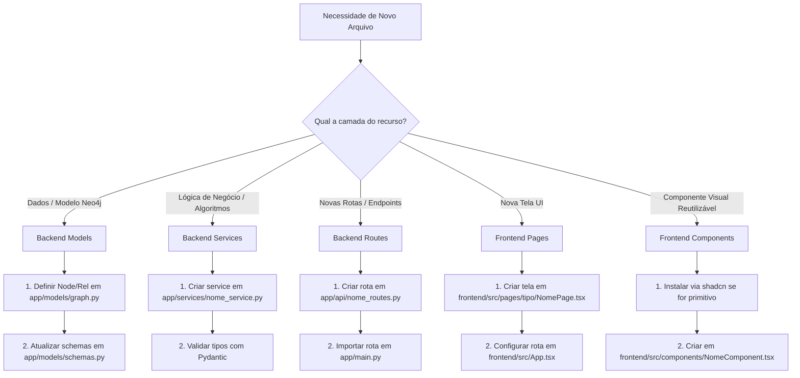

# 📘 Guia de Boas Práticas, Organização e Criação de Arquivos — ARIANO

> **Versão:** 1.0.0  
> **Data:** 20/05/2026  
> **Status:** Ativo  
> **Objetivo:** Estabelecer diretrizes claras para a organização do repositório, legibilidade do código, harmonização do design system e um fluxo passo a passo para a criação de novos arquivos no ecossistema do **Projeto ARIANO**.

---

## 1. Auditoria de Organização e Redundâncias do Repositório

Durante a análise detalhada do repositório atual, foram identificadas oportunidades importantes de melhoria estrutural e remoção de redundâncias. O objetivo destas correções é manter o repositório limpo, reduzir o peso dos arquivos e evitar confusão conceitual entre os membros da equipe.

### 🔍 Redundâncias e Inconsistências Identificadas

| Item | Descrição | Impacto | Recomendação de Organização |
| :--- | :--- | :--- | :--- |
| **Pasta `/backend`** | Contém apenas um `requirements.txt` duplicado, um arquivo de log local `server.log` e o PID do processo `uvicorn.pid`. O código real do backend reside na pasta `/app`. | **Confusão de Desenvolvimento:** Desenvolvedores novos podem pensar que `/backend` é onde o código-fonte deve ser editado. | **Remover a pasta `/backend`:** Centralizar as dependências e execuções no arquivo `/requirements.txt` da raiz e na pasta `/app`. Adicionar `*.pid` e `*.log` ao `.gitignore`. |
| **Arquivo `/tree.txt` (2.4 MB)** | Um arquivo de texto gigante com o mapeamento de diretórios do sistema, incluindo pastas geradas automaticamente como `node_modules` e ambientes virtuais. | **Lixo de Armazenamento:** Aumenta desnecessariamente o tamanho do git clone e dificulta buscas globais por texto. | **Remover o arquivo `/tree.txt`** ou regerá-lo utilizando filtros que excluam `node_modules`, `.git`, `.venv` e `dist`. |
| **Estrutura Flat em `/frontend/src/pages`** | Todas as telas estão no mesmo nível da pasta `/pages`. No entanto, o `01_DOCUMENTO_PROJETO_ARIANO.md` descreve que elas deveriam estar segmentadas nas subpastas `/user` e `/admin`. | **Falta de Modularidade:** Torna difícil identificar rapidamente quais páginas pertencem ao fluxo de usuário comum e quais pertencem à área administrativa. | **Refatorar para Subpastas:** Agrupar as páginas conforme descrito na documentação técnica (`pages/user/`, `pages/admin/`, `pages/auth/`). |
| **Duplicação de `requirements.txt`** | Há um arquivo na raiz da aplicação e outro dentro da pasta obsoleta `/backend`. | **Desalinhamento de Dependências:** Instalar dependências a partir do arquivo errado pode quebrar execuções locais ou em nuvem. | **Excluir `/backend/requirements.txt`** e usar estritamente o arquivo da raiz. |

---

## 2. Padrões de Legibilidade de Código e Harmonização

Para manter o código consistente entre diferentes desenvolvedores, utilize as seguintes regras de estilização, formatação e arquitetura:

### 🐍 Backend (FastAPI / Python)

1. **Nomes de Arquivos e Módulos:** Sempre em `snake_case` (ex: `graph_analysis.py`, `pdf_extractor.py`).
2. **Nomes de Classes:** Sempre em `PascalCase` (ex: `EligibleForRel`, `Student`).
3. **Nomes de Funções e Variáveis:** Sempre em `snake_case` (ex: `extract_text_from_pdf()`, `start_time`).
4. **Documentação e Tipagem:**
   - Adicione Docstrings no início de cada módulo e nas classes/funções complexas explicando seu objetivo.
   - Use Type Hints (anotações de tipo) em todas as funções públicas (ex: `def extract_text_from_pdf(file_bytes: bytes) -> str:`).
   - Utilize a ferramenta **Ruff** para formatação automática e remoção de código morto antes de qualquer commit.

### ⚛️ Frontend (Vite / React / TypeScript)

1. **Nomes de Arquivos:**
   - Componentes UI e Páginas: `PascalCase` (ex: `CadastroPage.tsx`, `ThemeToggleButton.tsx`).
   - Hooks, utilitários e lógica pura: `camelCase` (ex: `useAuth.ts`, `api.ts`).
2. **Design System (Tailwind CSS v4 + HSL):**
   - **NUNCA** utilize cores hardcoded (ex: `#fff`, `text-white`, `bg-black`). Use os tokens semânticos nativos do design system em HSL (ex: `bg-background`, `text-foreground`, `border-border`, `bg-card`).
   - Mantenha o background global translúcido em wrappers internos. O componente `<AppBackground />` deve ser visível ao fundo para dar o efeito de vidro (*glassmorphism*). Use classes como `bg-background/70 backdrop-blur-md` ou `bg-card/30`.
   - Elementos interativos devem ter estados claros de hover (`hover:bg-accent/50`), active e disabled.
3. **Ícones:** Use exclusivamente a biblioteca **Lucide React** com a classe de tamanho padrão `h-4 w-4` para manter a harmonia visual.

---

## 3. Fluxo de Criação de Novos Arquivos

Ao adicionar uma nova funcionalidade que necessite de novos arquivos no repositório, siga o fluxo de decisão estruturado abaixo:



### 🗺️ Onde Salvar cada Arquivo?

Para garantir que o repositório permaneça harmonioso, cada arquivo deve ser criado em uma pasta muito específica. Veja a tabela de mapeamento:

| Tipo de Arquivo | Pasta de Destino | Convenção de Nome | Exemplo |
| :--- | :--- | :--- | :--- |
| **Modelos do Grafo (Neo4j)** | `app/models/` | Adicionar à classe em `graph.py` | `class NovoPerfil(StructuredNode):` |
| **Schemas de Validação (Pydantic)** | `app/models/` | Adicionar/editar em `schemas.py` | `class NovoPerfilSchema(BaseModel):` |
| **Rotas da API Backend** | `app/api/` | `[recurso]_routes.py` (snake_case) | `user_routes.py` |
| **Serviços / IA Backend** | `app/services/` ou `app/agents/` | `[servico].py` (snake_case) | `pdf_extractor.py` |
| **Páginas do Frontend** | `frontend/src/pages/` | `[Nome]Page.tsx` (PascalCase) | `CadastroPage.tsx` |
| **Componentes Globais UI** | `frontend/src/components/` | `[Nome].tsx` (PascalCase) | `ThemeToggle.tsx` |
| **Componentes Shadcn** | `frontend/src/components/ui/` | Auto-gerado pelo CLI | `button.tsx` |
| **Hooks Customizados** | `frontend/src/hooks/` | `use[Nome].ts` (camelCase) | `useAuth.ts` |
| **Tipos TypeScript** | `frontend/src/types/` | Adicionar a `index.ts` | `export interface Match { ... }` |

---

## 4. Guia Passo a Passo: Criando um Novo Endpoint com Visualização Frontend

Para exemplificar o fluxo ideal, imagine a criação de uma nova funcionalidade (ex: "Visualização de Histórico de Matches"):

### Passo 1: Backend - Criação do Schema e Rota
1. Adicione a estrutura de dados necessária no Pydantic em `app/models/schemas.py`.
2. Crie o arquivo `app/api/history_routes.py` contendo o roteador FastAPI.
3. Importe o roteador em `app/main.py` com o respectivo prefixo:
   ```python
   from app.api.history_routes import router as history_router
   app.include_router(history_router, prefix="/api/history")
   ```
4. Teste localmente o endpoint chamando o Swagger em `http://localhost:8000/docs`.

### Passo 2: Frontend - Registro da API
1. Abra `frontend/src/lib/api.ts` e declare a chamada HTTP usando a instância do Axios:
   ```typescript
   export const getMatchHistory = (userUid: string) => 
     api.get<MatchHistory[]>(`/history/${userUid}`).then(r => r.data);
   ```

### Passo 3: Frontend - Criação do Layout / Tela
1. Crie a página física em `frontend/src/pages/user/MatchHistoryPage.tsx`.
2. Siga as restrições estéticas:
   - Importe `useAuth` para pegar os dados do usuário.
   - Use Tailwind v4 sem cores fixas (`bg-card/40`, `text-primary`).
   - Garanta que a página esteja envelopada no layout correto (`UserLayout`).
3. Registre a rota em `frontend/src/App.tsx`:
   ```tsx
   <Route path="/user/historico" element={<ProtectedRoute><UserLayout><MatchHistoryPage /></UserLayout></ProtectedRoute>} />
   ```

### Passo 4: Git - Commits Padronizados
Commit as alterações utilizando a convenção de commits descrita no planejamento (`Conventional Commits`):
- `feat(api): adicionar endpoint para histórico de matches`
- `feat(frontend): criar tela de histórico de matches sob layout do usuário`

---

## 5. Checklist de Revisão (Definition of Done)

Antes de abrir um Pull Request (PR) ou concluir um novo recurso, marque todos os itens abaixo como validados:

- [ ] **Ruff e ESLint:** O código passou na verificação de linting do backend (Ruff) e frontend (ESLint)?
- [ ] **Sem Cores Fixas:** O frontend utiliza estritamente variáveis HSL do design system em Tailwind?
- [ ] **Dark & Light Mode:** A visualização foi testada e permanece legível tanto no tema escuro quanto claro?
- [ ] **Responsividade:** A nova tela ou componente funciona adequadamente em mobile (375px) e desktop (1280px)?
- [ ] **Documentação Atualizada:** O novo arquivo respeita as regras de nomenclatura e sua função/endpoint está listada nas documentações relevantes?
- [ ] **Vercel Build:** Rodou `npm run build` localmente na pasta `frontend` para garantir que o compilador TypeScript não encontrou erros que impeçam o deploy automático?
